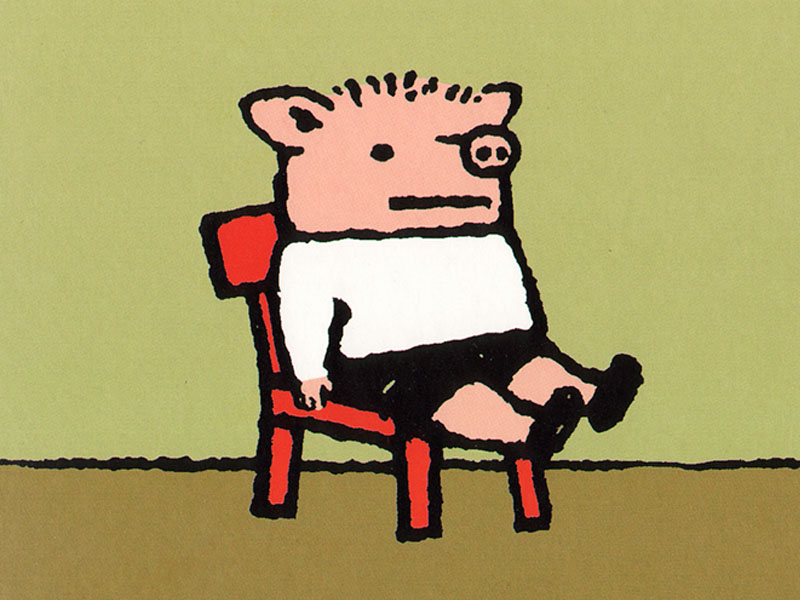

# Руководство по оформлению Markdown файлов

## Заголовки

Чтобы выделить заголовок в Markdown используется символ (#) или (##). Например,
# Заголовок первого уровня

## Списки 

Чтобы создать ненумерованный список используется символ (*) или (+). Например,

* Элемент 1
* Элемент 2

+ Элемент 1
+ Элемент 2

Чтобы создать нумерованный список используется нумерация (1,2,3...)

1. Элемент 1
2. Элемент 2

## Изображения

Чтобы вставить изображение используется "! [] ()". Например,

## Ссылки

Чтобы добавить ссылки используется "[] []". Например,

[Здесь ссылка] [https://gb.ru/education]

## Выделения 

Чтобы выделить текст жирным используется выделение с двух сторон (**) или (__), например, **вот так** или __вот так__.

Чтобы выделить текст курсивом используется выделение с двух сторон (*) или (_), например, *вот так* или _вот так_.

Чтобы выделить и курсивом и полужирным используется выделение с двух сторон (__*), например, __*вот так*__

Команды для гита:

git add 
git commit 